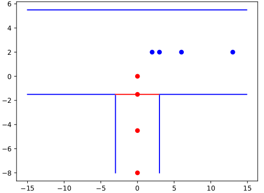

# STEM tool

## Install

The Python libraries are built automatically by the stem tool. Skip the next step (Manual Instructions).

### Manual Instructions
```
# constructs the virtual environment
python3 -m venv stem-env

# enables stem-env virtual environment
source stem-env/bin/activate
python3 -m pip install --upgrade pip

# install dependencies inside the virtual environment
pip install z3-solver sexpr sexpdata
```

## Usage

We demonstrate how to use our tool to monitor a simple spatio-temporal property with a trace.

The safety property describes whether two cars (C1 and C2) do not collide.

The [input file](../properties/no-colision.sprop) describing our property is a `.sprop` file (stem property file extension) with the content
```
(property "ltlxms:name"
    (always (not (overlap (prop "C1") (prop "C2"))))
)
```

First, we generate the monitor using the tool argument `-i` to pass the property file in `LTLxMS` language.
Then, we describe our scenario in OpenScenario format (extension file .xodr) using the argument `-c`.

Note! The input file `intersection_T.xodr` illustrates the static objects of our scenario.

To generate the monitoring model, we type
```
./src/stem.sh -g -u 3 -i ./properties/no-colision.sprop -c ./scenario/intersection_T.xodr -o monitoring-model.smt2
```

Our tool identifies the argument to generate the monitor by the flag `-g`. The output file is specified by `-o` and saves the file with the monitoring model containing the property to monitor.

To simulate the monitoring model and the trace satisfiability type
```
./src/stem.sh -s -m monitoring-model.smt2 -t ./traces/no-colision-c1-c2-trace.json -n "[(1,'C1'),(2,'C2')]"
```

The flag `-s` instructs the tool to simulate the monitoring model `-m` and the trace `-t`.
We also include flags `-u` to use the unroll method (`-l` sets the incremental evaluation), and `-n` sets a map between the spatial variables (from the monitoring model) and the identifiers of elements (e.g., `ID`) of the trace. Without this identifier, a spatial object cannot map to variables or spatial propositions.

The trace example file is available in [no-colision-c1-c2-trace.json](../traces/no-colision-c1-c2-trace.json), and the footprint of this trace is available in the figure below.



After running these commands, the expected output should be similar to

```
Frames = 4
Runtime =  0.13393616676330566
Checking satisfiability of the model... sat
(Time, Memory) = (0.014, 2.72)
```

The number of frames means the size of the trace, and runtime is the time the monitor generation process took without the execution time of the solver. Memory (in megabytes) and time (in seconds) means the time and memory the solver spent.
